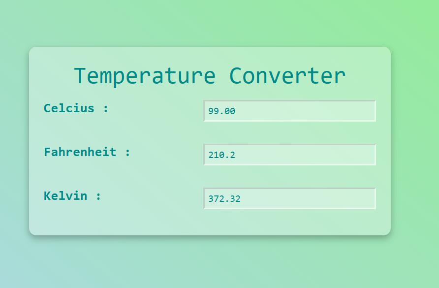

## 🌡️ Temperature Converter  

A simple and efficient **Temperature Converter** built using HTML, CSS, and JavaScript. This tool allows users to convert temperatures between Celsius, Fahrenheit, and Kelvin instantly.  

## 🚀 Features  
- ✅ Convert temperatures between **Celsius (°C), Fahrenheit (°F), and Kelvin (K)**  
- ✅ User-friendly interface with real-time conversion  
- ✅ Lightweight and fast performance  

## 🛠 Tech Stack  
HTML, CSS, JavaScript  

## 📷 Screenshots  
  

## 📌 How to Use  
1. Enter a temperature value in any field.    
2. Instantly view the converted values in other units.  

